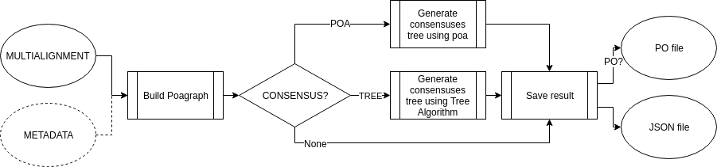
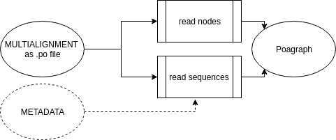
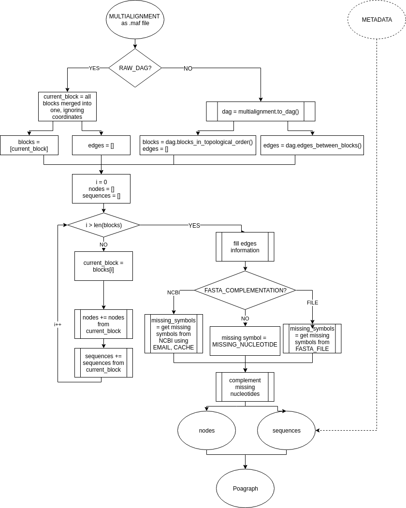
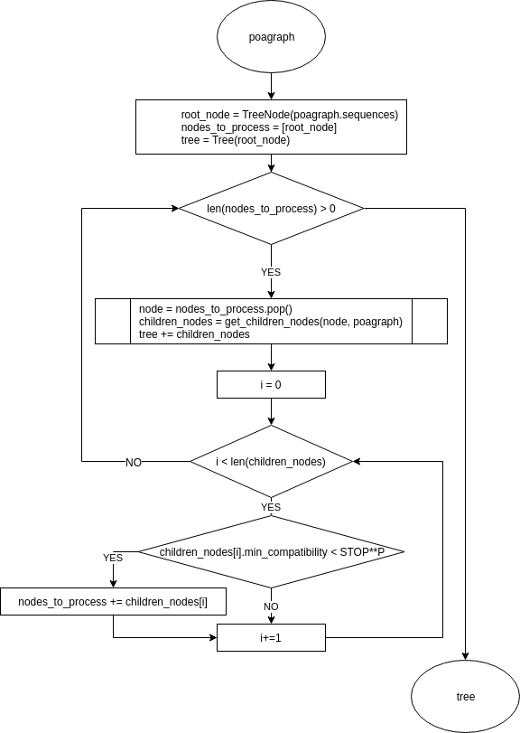
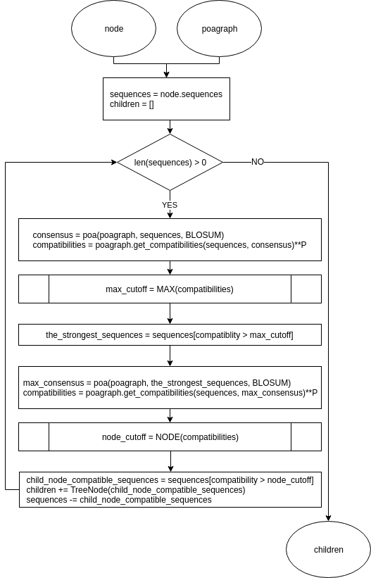

# PangtreeBuild

PangtreeBuild is a Python tool for multiple sequence alignment analysis. It implements the idea of pan-genome ([Ref. 1](https://doi.org/10.1093/bib/bbw089)) by representing the multialignment as a poa-graph (Partial Order Alignment Graph) and constructing a phylogenetic tree joined with an agreed sequence for every node.

[PL]
PangtreeBuild to narzędzie służące do analizy uliniowienia wielu sekwencji genetycznych. Implementuje ideę pangenomeu ([Ref. 1](https://doi.org/10.1093/bib/bbw089)) poprzez grafową reprezentację multiuliniowienia oraz konstrukcję drzewa filogenetycznego z kompromisową sekwencją dla każdego węzła.


## Getting Started

### Prerequisites

Running:
* [BioPython](https://biopython.org/)
* [numpy](http://www.numpy.org/)
* [jsonpickle](http://jsonpickle.github.io/)

Testing:
* [DDT](https://github.com/txels/ddt)


### Installing

```
python3 setup.py install
```
or

```
pip3 install poapangenome
```

### Quick installation check

```python -m pangtreebuild --multialignment data/Simulated/input/multialignment.maf```

## Idea and algorithm description 
[Pan-genome](https://en.wikipedia.org/wiki/Pan-genome) is a gene data structure being able to store multiple genomes with related data and be efficiently processed. This is a challenging bioinformatics task not only to design a pan-genome itself but also the algorithms it can be put into.

The idea of using partial order graphs as multiple sequence alignment representation (originally called PO-MSA, hereafter: *poagraph*) is introduced in [Ref. 2](https://doi.org/10.1093/bioinformatics/18.3.452). Such a graph can be constructed from an ordinary alignment in the following way:


Available tools provide not only this structure design but also an algorithm for finding consensuses in such a graph - Heaviest Bundle. As part of the above mentioned article, this algorithm implementation - software called [POA](https://sourceforge.net/projects/poamsa/) - was published.

*PantreeBuild* uses them both - the data structure (poagraph) and the software (POA). It builds a poagraph from .maf ([Multiple Sequence Alignment](https://genome.ucsc.edu/FAQ/FAQformat.html#format5)) or .po (POA specific format, example: data/Simulated/multialignment.po) file, runs Consensus Tree Algorithm (POA extension, described below) and saves result in a json file. This file can be further visualized in web-browser using [PangtreeViz](https://github.com/meoke/pangviz).

### PangtreeBuild flow diagram:


### Poagraph construction
Poagraph construction from .po file is straightforward as this format directly describes Poagraph according to its definition in POA software. Poagraph construction from .po:


Poagraph construction from .maf is trickier as this format does not ensure DAG and may not include all nucleotides from aligned sequences. Solution to the first problem is transforming the multialignment to DAG using [Mafgraph](https://github.com/anialisiecka/Mafgraph) and to the second one - complementing missing symbols from NCBI or local fasta files. Poagraph consruction from .maf:



### Consensuses finding

Representing a bunch of genomes using single sequence is a well-known problem([Ref. 3](https://doi.org/10.1016/0895-7177(93)90117-H)). POA software finds consensus paths in multialignment file but its application can be extended. A part of this project is Consensus Tree algorithm. It iteratively calls POA using sub-Poagraphs as input. The result is called Consensus Tree. Each node of this tree has the following data assigned:
- consensus path (appointed in original Poagraph)
- list of sequences it represents + compatibility value for every sequence (it expresses how similar is the consensus to the sequence)
- minimum compatibility - the mimimum of compatibilties assigned to node sequences.

Consensus Tree algorithm diagram:



Get children nodes details diagram:



## Usage

1. Import package **pangtreebuild** to your Python program.

or

2. Use **pangtreebuild** from command line with following arguments:

python -m pangenome [args]

| Name  | CLI | Required | Description
| ------------- | ------------- | ------- | ----------
| Arguments affecting poagraph build process: |
| MULTIALIGNMENT  | --multialignment  | Yes | Path to the mulitalignment file (.maf or .po)
| DATATYPE  | --datatype  | No, default = 'n' | Possible values: 'n' (nucleotides), 'p' (proteins).
| METADATA | --metadata | No | Optional information about sequences in csv format. The only required column: \'seqid\' and its value must match multialignment files identifiers as described in *Sequence Naming Convention* (below). Example: data\Ebola\ebola_metadata.csv
| RAW_MAF | --raw_maf | No, default=False | Build poagraph without transforming multialignment (maf) to DAG. Poagraph build in this way does not reflect real life sequences.
| FASTA_PROVIDER | --fasta_provider | No | Nucleotides/proteins source if any are missed in the multialignment. Possible values: 'ncbi', 'file'. If not specified: MISSING_NUCLEOTIDE is used.
| MISSING_SYMBOL | --missing_symbol | No, default='?' | Symbol for missing nucleotides/proteins, used if no FASTA_PROVIDER is given.
| CACHE | --cache | No, default='Yes' | If True, sequences downloaded from NCBI are stored on local disc and reused between program calls, used if Fasta Complementation Option is 'ncbi'
| FASTA_PATH | -fasta_path | Yes if FASTA_PROVIDER='FILE' | Path to fasta file or zipped fasta files with whole sequences present in multialignment, used if FASTA_PROVIDER is 'FILE'.
| Arguments affecting consensuses tree algorithm: |
| CONSENSUS | -consensus | No | Possible values: 'TREE' (tree algorithm), 'POA' (poa algorithm)
| BLOSUM | --blosum | No, default=bin\blosum80.mat |  Path to the blosum file which is used in consensus algorithm. Blosum file must include MISSING_NUCLEOTIDE. |
| HBMIN | -0hbmin | No, default=0.9 | 'POA' parameter. The minimum value of sequence compatibility to generated consensus.
| STOP | --stop | No, default=0.99 | 'TREE' parameter. Minimum value of compatibility in tree leaves.
| P | -p | No, default=1 | 'TREE' parameter. It changes the linear meaning of compatiblities during cutoff finding because the compatibilities are raised to the power o P. For p from range [0,1] it decreases distances between small compatibilities and increases distances between the bigger ones.For p > 1 it increases distances between small compatibilities and decreases distances between the bigger ones.
| Arguments affecting output format: |
| OUTPUT_DIR | --output_dir, -o | No, default=timestamped folder in current working directory | Output directory path.
| VERBOSE | --verbose, -v | No, default=False | Set if detailed log files must be produced.
| QUIET | --quiet, -q | No, default=False | Set to turn off console logging.
| OUTPUT_FASTA | --output_fasta | No, default=False | Set to create fasta files with consensuses.
| OUTPUT_PO | -output_po | No, default=False | Set to create po file with multialignment (without consensuses).

#### Sequence Naming Convention

[anything before first dot is ignored].[everything after first dot (also other dots) is interpreted as seqid]

#### PO file format specification
This section originates from [POA software](https://sourceforge.net/projects/poamsa/) README.

_File intro:_
```
VERSION= Current version of POA,e.g. LPO.1.0

NAME=  Name of PO-MSA.  Defaults to name of 1st sequence in PO-MSA

TITLE=  Title of PO-MSA.  Defaults to title of 1st sequence in PO-MSA

LENGTH= Number of nodes in PO-MSA

SOURCECOUNT= Number of sequences in PO-MSA
```
_For each sequence in the PoaGraph:_
```
SOURCENAME= Name of sequence taken from FASTA sequence header

SOURCEINFO= Number of nodes in sequence 
            [Index of first node containing sequence] [Sequence weight] [Index of bundle containing sequence] [Title of sequence taken from FASTA sequence header]
```
_Example:_
```
SOURCENAME=GRB2_HUMAN

SOURCEINFO=217 10 0 3 GROWTH FACTOR RECEPTOR-BOUND PROTEIN 2 (GRB2 ADAPTOR PROTEIN)(SH2)
```
_For each node in the PO-MSA:_
```
Residue label:'L' delimited index list of other nodes with edges into node
              'S' delimited index list of sequences stored in each node
              'A' index of next node in same align ring
                     NB: align ring indices must form a cycle.
                     e.g. if two nodes 121 and 122 are aligned, then 
                     the line for node 121 indicates "A122", and
                     the line for node 122 indicates "A121".
``` 
_Example:_
```
F:L156L155L22S2S3S7A158
```

### Example use cases
1. Build poagraph using default settings (transform to DAG, download missing nucleotides from NCBI) and save to .po file :
```
python -m pangenome -m data/Ebola/input/multialignment.maf -po

```
will produce:

- pangenome.json
- poagraph.po

2. Generate consensuses tree, use metadata, detailed logging and default algorithm settings.
```
python3 -m pangenome -m data/Ebola/input/multialignment.maf -metadata data/Ebola/input/metadata.csv -consensus tree -v
```
will produce:

- pangenome.json
- details.log
- consensus/
    - tresholds.csv
    - *.po files from internal calls to poa software*


## Development

### Running the tests
```
python -m unittest discover -s tests -t . -p tests_*
```


## Authors
This software is developed with support of [OPUS 11 scientific project of National Science Centre:  Incorporating genomic variation information 
into DNA sequencing data analysis](https://www.mimuw.edu.pl/~dojer/rmg/)


## License

This project is licensed under the MIT License - see the [LICENSE.md](LICENSE.md) file for details

