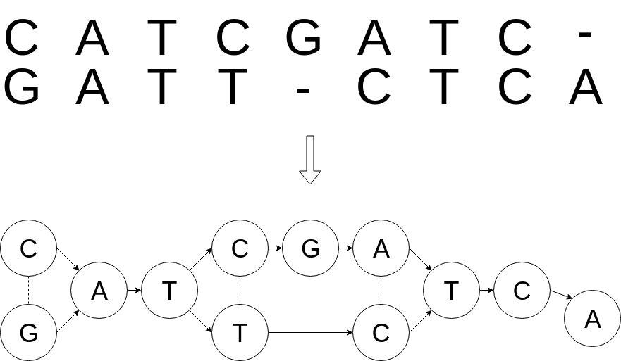

# Poapangenome

Tool for analysis and visualisation of multiple sequence alignment. It implements the idea of pan-genome ([Ref. 1](https://doi.org/10.1093/bib/bbw089)) by representing the multialignment as a poa-graph (Partial Order Alignment Graph) and constructing a phylogenetic tree joined with an agreed sequence for every node.

[PL]
Narzędzie służące do analizy i wizualizacji uliniowienia wielu sekwencji genetycznych. Implementuje ideę pangenomeu ([Ref. 1](https://doi.org/10.1093/bib/bbw089)) poprzez grafową reprezentację multiuliniowienia oraz konstrukcję drzewa filogenetycznego z kompromisową sekwencją dla każdego węzła. 


## Getting Started

### Prerequisites

Running:
* [BioPython](https://biopython.org/)
* [Mafgraph](https://github.com/anialisiecka/Mafgraph)
* [numpy](http://www.numpy.org/)
* [jsonpickle](http://jsonpickle.github.io/)

Testing:
* [DDT](https://github.com/txels/ddt)


### Installing

```
python3 setup.py install
```
or

```
pip3 install poapangenome
```

### Quick installation check

```python -m pangenome --multialignment data/Fabricated/f.maf --metadata data/Fabricated/f_metadata.csv```

## Idea and algorithm description 
[Pan-genome](https://en.wikipedia.org/wiki/Pan-genome) is a gene data structure being able to store multiple genomes with related data and be efficiently processed. This is a challenging bioinformatics task not only to design a pan-genome itself but also the algorithms it can be put into.

The idea of using partial order graphs as multiple sequence alignment representation (hereafter: *poagraph*) is introduced in [Ref. 2](https://doi.org/10.1093/bioinformatics/18.3.452). Such a graph can be constructed from an ordinary alignment in the following way:



POA is not only a graph design but also an algorithm for finding consensuses in such a graph. As part of the above mentioned article, this algorithm implementation - software called [poa](https://sourceforge.net/projects/poamsa/) - was published. 

*Pangenome* uses them both - the data structure (poagraph) and the software (poa). It builds a poagraph from .maf ([Multiple Sequence Alignment](https://genome.ucsc.edu/FAQ/FAQformat.html#format5)) or .po (poa specific format, example: data/Fabricated/f.po) file, runs Consensus Tree Algorithm (poa extension, described below) and saves result in json file. This file can visualized in web-browser using [poaviz](https://github.com/meoke/pangviz).

### Pangenome flow diagram:


### Poagraph construction
Poagraph construction from .po file is straightforward, as this format directly describes Poagraph as defined in poa. Poagraph construction from .po:


Poagraph construction from .maf is trickier as this format does not ensure DAG and may not include all nucleotides/proteins from aligned sequences. Solution to the first problem is transforming the multialignment to DAG using [Mafgraph](https://github.com/anialisiecka/Mafgraph) and to the second one - complementing missing symbols from NCBI or local fasta files. Poagraph consruction from .maf:


### Consensuses finding

Representing a bunch of genomes using single sequence is a well-known problem([Ref. 3](https://doi.org/10.1016/0895-7177(93)90117-H)). Poa software finds consensus paths in multialignment file but its application can be extended. A part of this project is Tree Consensus Generation algorithm. It iteratively calls poa using sub-Poagraphs. As a results a tree (ConsensusTree) is generated where every node contains:
- consensus path (appointed in original Poagraph)
- list of sequences it represents + compatibility value for every sequence (it expresses how similar is the consensus to the sequence)
- minimum compatibility - the mimimum of compatibilties assigned to node sequences.

Consensus tree algorithm diagram:


Get children nodes details diagram:


An important part of this algorithm is defing node cutoff - compatibility value which demarcates sequences qualified to a node. There are different strategies available:
```
MAX:
- **MAX1** (parameter: cutoff_search_range)
    - uporządkuj rosnąco compatibilities
    - znajdź największą różnicę występującą pomiędzy dwoma kolejnymi compatibility **Ci**, **Cj** na przedziale *cutoff_search_range*, gdzie przedział wyznacza indeksy na uporządkowanej liście compatibilities
     - **cutoff** = **Cj**
- **MAX2**
    - uporządkuj rosnąco compatibilities
    - znajdź największą różnicę występującą pomiędzy dwoma kolejnymi compatibility **Ci**, **Cj**
    - **cutoff** = **Cj**
```
```
NODE:
- **NODE1** [parameter: multiplier]
    - uporządkuj compatibilities rosnąco
    - policz średnią odległość między compatibilities
    - znajdź pierwsze takie **Ci**, **Cj**, pomiędzy którymi odległość jest większa niż średnia odległość * *multiplier*. Jeśli nie istnieją, ponów wyszukiwanie dla multiplier = 1. 
    - **cutoff** = **Cj**
 - **NODE2** (with level guards: compatibilites of sibling nodes) [parameter: multiplier]
    - IF lista **level_guards** jest pusta:
        - użyj NODE1
    - ELSE
        - guard = min(**level_guards**)
        - IF guard <= wszystkie compatibilities:
            - **cutoff** = min(compatibilities)
        - ELIF guard > wszystkie compatibilities:
            - użyj NODE1
        - ELSE
            - dodaj guard do compatibilities 
            - uporządkuj compatibilities rosnąco
            - policz średnią odległość między compatibilities
            - usuń guard z compatibilities (nie ma sensu zwracać go jako wynik jeśli nie było go oryginalnie wśród compatibilities)
            - wśród compatibilities nie większych niż guard znajdź pierwsze takie **Ci**, **Cj**, pomiędzy którymi odległość jest większa niż średnia odległość * *multiplier*
            - jeśli nie ma takich **Ci**, **Cj**:
            - **cutoff** = pierwsze compatibility większe niż guard
- **NODE3** (with level guards)
    - IF lista **level_guards** jest pusta:
        - użyj strategii MAX2
    - ELSE
        - guard = min(**level_guards**)
        - IF guard <= wszystkie compatibilities:
            - **cutoff** = min(compatibilities)
        - ELSE
            - search_boundary = indeks pierwszego compatibility większego niż guard albo max(compatibilities) (gdy guard > wszystkie compatibilities)
            - użyj strategii MAX2 na przedziale [0, search_boundary]
- **NODE4**
    - użyj MAX2
```

## Usage

1. Import package **poapangenome** to your Python program. Check [API documentation]().

or

2. Use **poapangenome** from command line with following arguments:

python -m pangenome [args]

| Name  | CLI | Required | Description
| ------------- | ------------- | ------- | ----------
| Arguments affecting poagraph build process: |
| MULTIALIGNMENT  | --multialignment  | Yes | Path to the mulitalignment file (.maf or .po)
| DATATYPE  | --datatype  | No, default = 'n' | Possible values: 'n' (nucleotides), 'p' (proteins).
| METADATA | --metadata | No | Optional information about sequences in csv format. The only required column: \'seqid\' and its value must match multialignment files identifiers as described in *Sequence Naming Convention* (below). Example: data\Ebola\ebola_metadata.csv
| RAW_MAF | --raw_maf | No, default=False | Build poagraph without transforming multialignment (maf) to DAG. Poagraph build in this way does not reflect real life sequences.
| FASTA_PROVIDER | --fasta_provider | No | Nucleotides/proteins source if any are missed in the multialignment. Possible values: 'ncbi', 'file'. If not specified: MISSING_NUCLEOTIDE is used.
| MISSING_NUCLEOTIDE | --missing_symbol | No, default='?' | Symbol for missing nucleotides, used if no FASTA_PROVIDER is given.
| CACHE | --cache | No, default='Yes' | If True, sequences downloaded from NCBI are stored on local disc and reused between program calls, used if Fasta Complementation Option is 'ncbi'
| FASTA_FILE | -fasta_source_file | Yes if FASTA_PROVIDER='FILE' | Path to fasta file or zipped fasta files with whole sequences present in multialignment, used if FASTA_PROVIDER is 'FILE'.
| Arguments affecting consensuses tree algorithm: |
| CONSENSUS | -consensus | No | Possible values: 'TREE' (tree algorithm), 'POA' (poa algorithm)
| BLOSUM | --blosum | No, default=bin\blosum80.mat |  Path to the blosum file which is used in consensus algorithm. Blosum file must include MISSING_NUCLEOTIDE. |
| HBMIN | -0hbmin | No, default=0.9 | 'POA' parameter. The minimum value of sequence compatibility to generated consensus.
| STOP | --stop | No, default=0.99 | 'TREE' parameter. Minimum value of compatibility in tree leaves.
| MAX | --max | No, default=MAX2 | 'TREE' parameter. Max cutoff finding strategy. Available values: 'MAX1', 'MAX2'.
| NODE | --node | No, default=NODE3 | 'NODE' parameter. Node cutoff finding strategy. Available values: 'NODE1', 'NODE2', 'NODE3', 'NODE4'
| R | --r | No, default=[0,1] | 'MAX1' parameter. Specifies what part of sorted capabilities should be searched for node cutoff. Format: '[a, b]' where a, b in [0, 1] and a < b. 
| MULTIPLIER | -multiplier | No, default=1 | 'NODE1' and 'NODE2' parameter. It controls the size of gaps for node cutoff. The greater it is, the more granular the tree is.
| P | -p | No, default=1 | 'TREE' parameter. It changes the linear meaning of compatiblities during cutoff finding because the compatibilities are raised to the power o P. For p from range [0,1] it decreases distances between small compatibilities and increases distances between the bigger ones.For p > 1 it increases distances between small compatibilities and decreases distances between the bigger ones.
| Arguments affecting output format: |
| OUTPUT_DIR | --output_dir, -o | No, default=timestamped folder in current working directory | Output directory path.
| VERBOSE | --verbose, -v | No, default=False | Set if detailed log files must be produced.
| QUIET | --quiet, -q | No, default=False | Set to turn off console logging.
| FASTA | --output_fasta | No, default=False | Set to create fasta files with consensuses.
| PO | -output_po | No, default=False | Set to create po file with multialignment (without consensuses).

#### Sequence Naming Convention

[anything before first dot is ignored].[everything after first dot (also other dots) is interpreted as seqid]

### Example use cases
1. Build poagraph using default settings (transform to DAG, download missing nucleotides from NCBI) and save to .po file :
```
python -m pangenome -m data/Ebola/Ebola.maf -po

```
will produce:

- pangenome.json
- poagraph.po

2. Generate consensuses tree, use metadata, detailed logging and default algorithm settings.
```
python3 -m pangenome -m data/Ebola/Ebola.maf -metadata data/Ebola/Ebola.maf -consensus tree -v
```
will produce:

- pangenome.json
- details.log
- consensus/
    - tresholds.csv
    - *.po files from internal calls to poa software*


## Development

### Documentation
```
TBA
```
### Running the tests
```
python -m unittest discover -s tests -t . -p tests_*
```

### Contributing
```
TBA
```


## Authors
This software is developed with support of [OPUS 11 scientific project of National Science Centre:  Incorporating genomic variation information 
into DNA sequencing data analysis](https://www.mimuw.edu.pl/~dojer/rmg/)


## License

This project is licensed under the MIT License - see the [LICENSE.md](LICENSE.md) file for details

## Bibliography
1. [**Computational pan-genomics: status, promises and challenges**](https://doi.org/10.1093/bib/bbw089) 
The Computational Pan-Genomics Consortium. Briefings in Bioinformatics, Volume 19, Issue 1, January 2018, Pages 118–135.

2. [**Multiple sequence alignment using partial order graphs**](https://doi.org/10.1093/bioinformatics/18.3.452) Christopher Lee,  Catherine Grasso,  Mark F. Sharlow.
Bioinformatics, Volume 18, Issue 3, March 2002, Pages 452–464.

3. [**The computation of consensus patterns in DNA sequences**](https://doi.org/10.1016/0895-7177(93)90117-H) William H.E.DayF.R.McMorris. Mathematical and Computer Modelling
Volume 17, Issue 10, May 1993, Pages 49-52

                        
